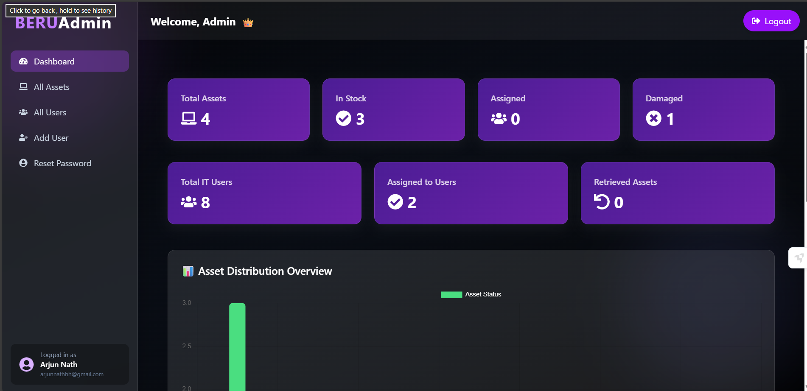
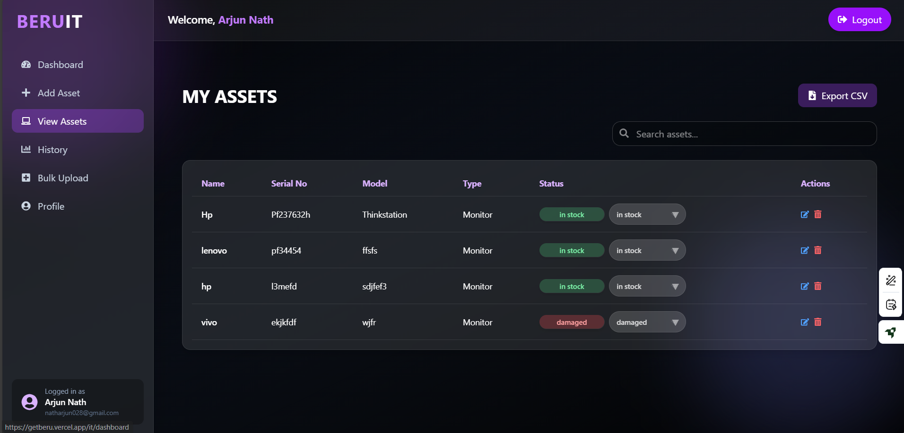
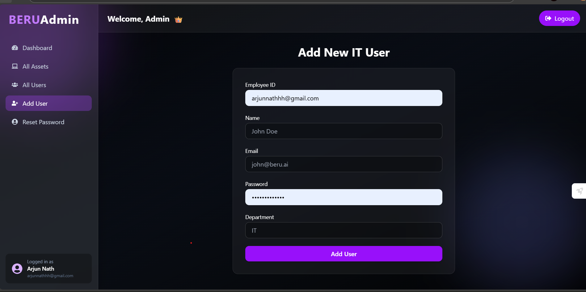
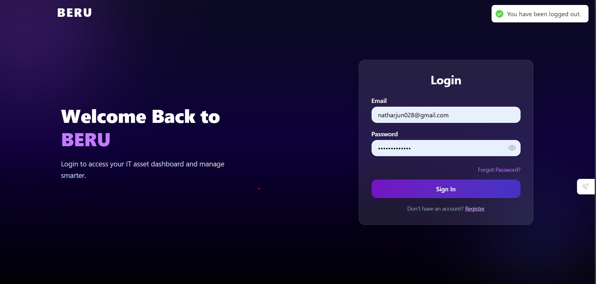

# 🧠 BERU – Intelligent Asset Management System  

> A modern full-stack Asset Management System built for IT and Operations teams to track, assign, and manage assets seamlessly — with role-based access, audit logging, and enterprise-grade architecture.

---

## 🚀 Overview

**BERU** is a scalable web platform designed for real-world IT asset lifecycle management.  
It enables teams to manage company hardware, software, and accessories from procurement to retirement — while ensuring accountability, transparency, and compliance.

---

## ✨ Key Industry Features

- 🔐 **JWT-based Authentication** – Secure user sessions with refresh tokens  
- 🧩 **Role-Based Access Control (RBAC)** – Fine-grained control for Admins, Managers & Employees  
- 🧾 **Full Asset Lifecycle Management** – Procurement → Assignment → Maintenance → Decommission  
- 🕒 **Complete Activity & History Logging** – Every action is tracked for audit readiness  
- 🧠 **Smart Asset Status System** – Auto-updates status on assignment, return, or disposal  
- 🧰 **Dynamic Filters & Search** – Quickly find assets or users with instant response  
- 📊 **Analytics Dashboard** – Real-time insights on asset utilization and category trends  
- 📨 **Automated Email Notifications** – Triggered for assignments, status updates & actions  
- ⚙️ **Modular Microservice-Ready Backend** – Clean controller-service-model separation  
- 📱 **Responsive Modern UI** – Built for both desktop and tablet operations  
- 🌐 **Centralized API Utility** – Manage base URLs & environment variables from one file  
- 🛠️ **Secure .env Configuration** – Environment-specific variables and backend URL handling  
- 🧾 **Error Logging & Exception Handling** – Graceful fallbacks and consistent API responses  
- 🧩 **Scalable Folder Architecture** – Ready for enterprise or SaaS deployment  

---

## 🖥️ Tech Stack

### 🧱 Frontend
- React.js + Vite  
- Tailwind CSS  
- Framer Motion (for animations)  
- React Router DOM  
- Axios (API integration)  

### ⚙️ Backend
- Node.js + Express.js  
- MongoDB + Mongoose  
- JWT for authentication  
- bcrypt for password hashing  
- Nodemailer for automated emails  

### 🧩 DevOps / Deployment
- Render (Backend Hosting)  
- Netlify / Vercel (Frontend Hosting)  
- GitHub Actions (CI/CD ready)  

---


---

## 🧑‍💼 User Roles & Permissions

| Role | Permissions |
|------|--------------|
| **IT Admin** | Full CRUD access to assets, users ,Assign/unassign assets, view analytics and logs |
| **System Admin** | View all Users , assets , manage users and reset user psswwds |

---

## 🧩 Core Modules

- **Authentication Module** → Secure login + token refresh  
- **Asset Module** → Create, view, edit, and delete assets  
- **User Management Module** → Add, assign, or suspend users  
- **History Module** → Centralized audit logs  
- **Mail Module** → Action-based notifications  
- **Settings Module** → Configurable organization preferences  

---

## 🪄 Screenshots  

### 🏠 Dashboard  


### 💼 Assets Management  


### 👥 Users Management  


### 🔐 Login Page  


---

## ⚙️ Local Setup

```bash
# Clone repo
git clone https://github.com/yourusername/beru.git
cd beru

# Setup backend
cd backend
npm install
npm run dev

# Setup frontend
cd ../frontend
npm install
npm run dev
```

## 🧠 Author

**Arjun Nath**  
Full-Stack Engineer | AI-Native Developer  
[LinkedIn]([https://www.linkedin.com/in/arjun-nath](https://www.linkedin.com/in/arjun-nath-9b436823a?lipi=urn%3Ali%3Apage%3Ad_flagship3_profile_view_base_contact_details%3BT%2Few8YzpScKXkqAM7lqkXw%3D%3D)) · [GitHub](https://github.com/Kuromi1234)
