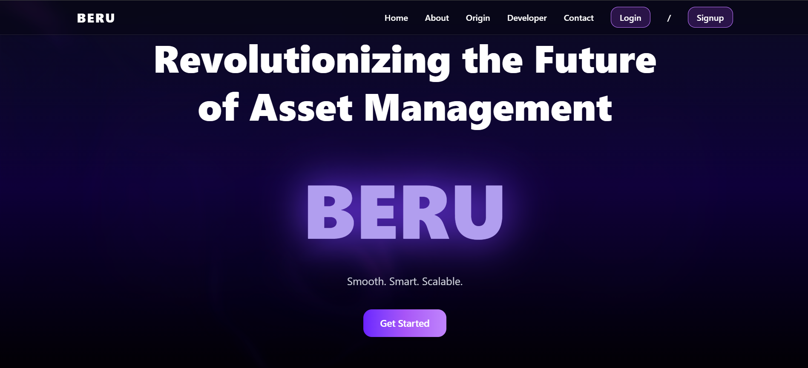

# 🏢 BERU — Intelligent IT Asset Tracker

[](#license)
[]()
[]()
[]()
[](https://getberu.vercel.app/)

> **BERU** is a sleek, modern, and intelligent **IT Asset Management System** crafted for IT teams that value aesthetics and automation.  
> It streamlines the lifecycle of IT hardware — from purchase to assignment to retrieval — all wrapped in a **cinematic UI** built for the modern enterprise.




🌐 **Live Website:** [https://getberu.vercel.app/](https://getberu.vercel.app/)

---

## 🧭 Overview

**BERU** combines design, efficiency, and automation to make IT asset management effortless.  
Built using **React + Tailwind + Node.js + MongoDB**, it enables admins to manage inventory, track usage, and trigger real-time email alerts — all through a stunning, responsive dashboard.

---

Beru/
├── backend/ # Node.js + Express backend (API & business logic)
├── frontend/ # React + Vite + Tailwind frontend
│ ├── src/
│ │ └── utils/config.js # Smart environment-based API URL handler
├── package.json # Root scripts & dependency control
└── README.md # You’re reading it ;)


---

## 🧱 Tech Stack

| Layer        | Technology / Framework                |
|---------------|---------------------------------------|
| **Frontend**  | React (Vite) + Tailwind CSS + Framer Motion |
| **UI Library**| shadcn/ui + Lucide Icons              |
| **Backend**   | Node.js + Express                     |
| **Database**  | MongoDB (via Mongoose)                |
| **Auth**      | JWT-based Authentication              |
| **Email**     | Nodemailer (SMTP trigger for asset events) |
| **Hosting**   | Frontend → Vercel · Backend → Render  |

---

## ⚙️ Environment Config — Smart Utility Setup

The frontend features a **centralized config file** (`/src/utils/config.js`) that automatically picks the backend API URL based on the **environment** (dev or prod):

```js
// Example: config.js
const BASE_URL =
  import.meta.env.MODE === "development"
    ? "http://localhost:5000"
    : "https://beru-backend.onrender.com";

export default BASE_URL;

✅ This ensures seamless switching between local development and production deployment without manual edits.

🏢 Enterprise-Grade Features (Built for Real IT Teams)

BERU isn’t just a CRUD system — it’s designed with real-world IT infrastructure practices.
Here’s what makes it industry-ready 👇

🔐 JWT Authentication — Secure login for admins and employees with token-based sessions

🧩 Role-Based Access Control (RBAC) — Granular permissions between Admins and Employees

🧾 Full Asset Lifecycle Tracking — From procurement → assignment → retrieval → retirement

🧠 Lifecycle History Logs — Tracks every asset event with timestamp and actor metadata

🗄️ Centralized API Architecture — RESTful APIs built on Express.js for modular scalability

📨 Email Notification System — Automated triggers via Nodemailer for assignment/retrieval

⚙️ Smart Environment Configs — Auto-detects dev vs prod environments via config.js

🧮 Analytics Layer — Aggregated statistics, category breakdowns, and usage insights

📊 Visual Dashboard with Filters — Real-time asset overview via Framer Motion + Shadcn UI

💾 Bulk CSV Import/Export — Handles large-scale data efficiently

🧰 PDF Report Generation — One-click downloadable analytics reports

🕵️ Audit & Event Logging — Maintains consistency and accountability in asset operations

🧱 Modular Folder Structure — Cleanly separated layers for maintainability

💻 Responsive Design — Fully optimized for desktop and mobile

☁️ Deployed on Modern Cloud Stack — Frontend (Vercel) + Backend (Render) + MongoDB Atlas

🚦 Cold Start Handling — Gracefully manages Render’s idle state latency


🚀 Getting Started
Prerequisites

Node.js (v16+)

npm or yarn

MongoDB instance (local or cloud)

Internet connection (Render has cold-start delays)

🧩 Setup Guide
1. Clone the Repository

git clone https://github.com/Kuromi1234/Beru.git
cd Beru

2. Backend Setup
cd backend
cp .env.example .env
# Fill in DB_URI, JWT_SECRET, EMAIL_USER, EMAIL_PASS, etc.

npm install
npm run dev

3. Frontend Setup
cd ../frontend
cp .env.example .env
# Set VITE_API_URL or rely on config.js auto-switch logic

npm install
npm run dev

⚡ Note on Login Latency

Render (free tier) puts the backend to sleep after 15 minutes of inactivity.
The first login after idle time may take ~800–900ms, after which responses are instant ⚡

💎 Core Features
👨‍💼 IT  Capabilities

Add, edit, or delete assets

Assign or retrieve assets for employees

Real-time analytics dashboard

Bulk upload via CSV

Export reports (CSV / PDF)

Automated email triggers on assignment or retrieval

💡 Note: Employee emails must currently be updated manually in the backend for email triggers.

👩‍💻 System Admin 

View assigned assets

Real-time analytics dashboard

Add IT Users , delete users , reset password for the Users

📊 Analytics & Insights

Visual dashboard of total, assigned, in-stock, and damaged assets

Advanced search, filter, and export options

Beautiful chart-based summaries (powered by shadcn + motion)

📬 Email Trigger Events
Event	Recipient	Description
Asset Assigned	Employee	Sends details of newly assigned asset
Asset Retrieved	Employee	Confirms asset retrieval successfully

🌗 UI Highlights

🎬 Cinematic landing page with smooth scroll transitions
🪟 Glassmorphism + Neon gradients for modern aesthetic
💫 react.bits components integrated 
📱 Fully responsive layout for mobile and desktop

👤 Author

Arjun Nath
🚀 Full Stack Developer · AI Enthusiast · Building Future-Proof Systems

GitHub → @Kuromi1234

Live Demo → https://getberu.vercel.app/

💬 Closing Note

BERU isn’t just another CRUD system — it’s an experience.
Built with precision, motion, and performance in mind, it redefines how IT teams interact with their assets.
Minimal. Intelligent. Beautiful.
— BERU, by Arjun Nath.
